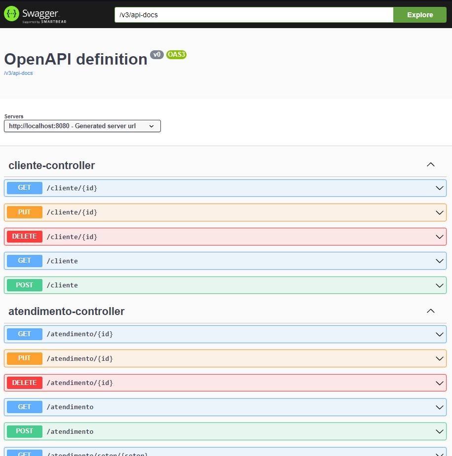
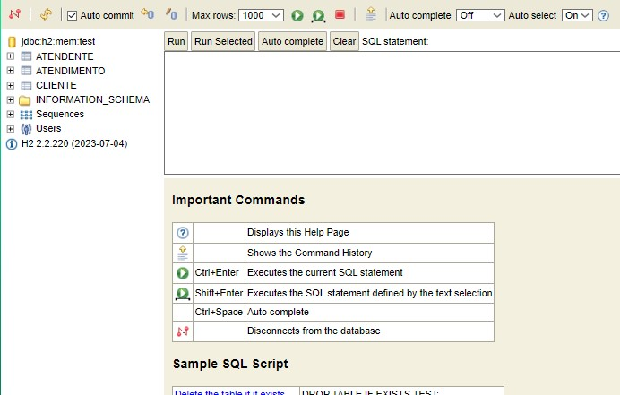

# Ubots FlowPlay

FlowPay is a backend solution for a relationship center.
This central The relationship will meet different types of customer requests. The main types of transactions are like card problems and taking out a loan, according to the specification presented in [Documentation (pt-BR)](Documentation/Especificacao.pdf).

All the data is stored in a temporary memory-based database, so we have all the "persistence" from a database without the need for a properly installed one, for the purposes of this Tech Demo

## Technologies Used 🛠️

[](https://www.java.com/pt-BR/)
[](https://spring.io/)
[](https://swagger.io/)
[](https://www.postman.com/)
[![H2Database](https://img.shields.io/badge/H2%20Database-%2309476b?style=for-the-badge&logo=data:image/svg+xml;base64,PHN2ZyB3aWR0aD0iMjMzLjYzMiIgaGVpZ2h0PSIyMzMuNjMzIiB2aWV3Qm94PSIwIDAgNjEuODE1IDYxLjgxNSIgeG1sbnM9Imh0dHA6Ly93d3cudzMub3JnLzIwMDAvc3ZnIj4KICA8cGF0aCBkPSJNMTE4Ljg4OCAxNDIuMzE2cS41NDctLjA2IDEuMDgtLjA1OSAyLjY4MSAwIDQuMTEgMS4yMSAxLjQyNyAxLjIxIDEuNDI3IDMuNDMzIDAgMS44NTQtMS4xMTEgMy43NS0xLjExMyAxLjg5Ny0zLjc1IDQuNDQ4LTEuNzY2IDEuNzItNC42OTggNC4wOTdhMTM2IDEzNiAwIDAgMS01Ljg1MyA0LjQ5MnY1LjM2MmgyNS40ODR2LTYuMjEyaC0xNC41ODRhMTM0IDEzNCAwIDAgMCAyLjg1NS0yLjE0OCA1NyA1NyAwIDAgMCAzLjk5LTMuMzY4cTMuMTYtMi45NDMgNC42OTgtNS43MTEgMS41MzYtMi43NyAxLjUzNy01Ljg0MyAwLTQuNjg2LTMuMjA1LTcuMjQ5LTMuMjA1LTIuNTYtOS4zMDgtMi41NjEtMS4zMzcgMC0yLjY3Mi4xMzJ2LTEyLjQwMmgtOC41MzRWMTM1LjhIOTcuNzUzdi0xMi4xMTNoLTguNTM0djMzLjA5Mmg4LjUzNFYxNDIuMmgxMi42MDF2MTQuNThoLjA5N3ExLjItLjkzIDIuNDAxLTEuOTA0IDIuOTMyLTIuMzc2IDQuNjk4LTQuMDk4LjcyNy0uNzA0IDEuMzM5LTEuMzU3em0tMTMuMjg2IDI1LjgzMWMtMTYuMDYgMC0yOS4xMzQtMTMuMDczLTI5LjEzNC0yOS4xMzQgMC0xNi4wNDggMTMuMDYtMjkuMDczIDI5LjEzNC0yOS4wNzMgMTYuMDYgMCAyOS4wNzMgMTMuMDEzIDI5LjA3MyAyOS4wNzN2LjkwM2gxLjgwNHYtLjkwM2MwLTE3LjA1Ny0xMy44Mi0zMC44NzctMzAuODc3LTMwLjg3Ny0xNy4wNjkgMC0zMC45MzggMTMuODMxLTMwLjkzOCAzMC44NzcgMCAxNy4wNTggMTMuODggMzAuOTM4IDMwLjkzOCAzMC45MzhoLjkwMnYtMS44MDR6IiBzdHlsZT0iZmlsbDojZmZmO2ZpbGwtb3BhY2l0eToxO3N0cm9rZS13aWR0aDouOTAyMTk4IiB0cmFuc2Zvcm09InRyYW5zbGF0ZSgtNzQuNjY0IC0xMDguMTM2KSIvPgo8L3N2Zz4K)](http://www.h2database.com/)

## Using the solution :rocket:

1. Clone this repository to your computer:
   ```bash
   git clone https://github.com/GiovaniRizzato/Ubots-FlowPay
   ```
2. Run the application using the Springboot IDE of your choice or enter the commands:
   ```bash
   mvn dependency:resolve
   mvn spring-boot:run
   ```

## Using Consoles :clipboard:

Swagger: at \[localhost:port]/swagger-ui/index.html


H2 Dashboard: \[localhost:port]/h2-console



